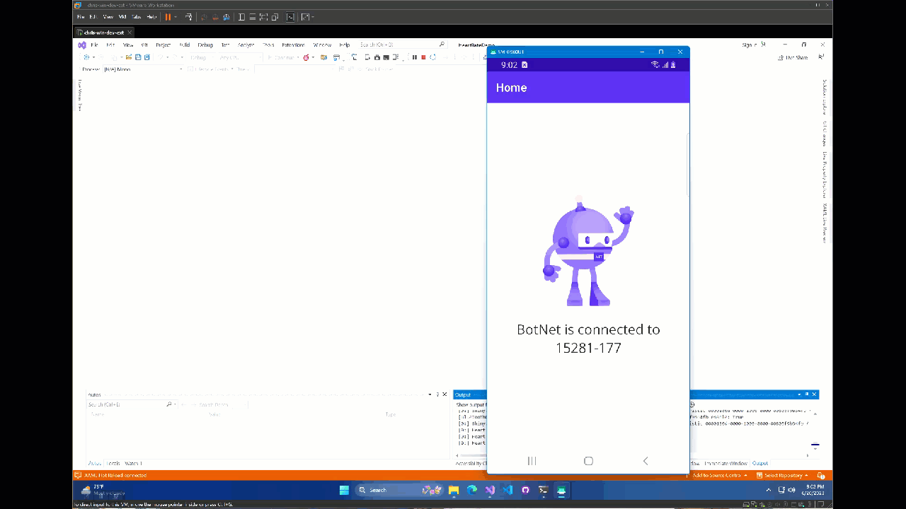

# Heart Rate Monitor and Microsoft .NET MAUI Demonstration Project

## Build Status

## Author

Created by Christopher Zenzel

## Platforms

### Supported Platforms

* Android
* iOS

### Disabled Platforms

These platforms were disabled in the build as I presently didn't have a Mac Build Agent setup to test it:

* iOS

## Description

This project uses Microsoft .NET MAUI from Microsoft .NET SDK 7.x. It uses the pre-release Shiny Bluetooth Library along with Dependency Injection (DI) to create a fully working solution to scan and connect to a nearby heart rate monitor and actively read the heart rate over a specified period of time.
